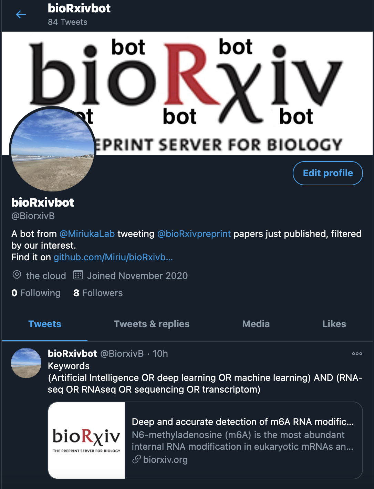

# **bioRxivbot**

A twitter bot from [@MiriukaLab](https://twitter.com/MiriukaLab) for filtering just published  [@bioRxivpreprint](https://twitter.com/biorxivpreprint) papers according to keywords. The first clon can be followed at [@BiorxivB](https://twitter.com/BiorxivB). 



**Purpose:** A bot that checks bioRxiv papers published the day before and tweets them if provided keywords are found in the abstract. Ideally, you should set crontab in a server for a scheduled activation and tweeting. Alternatively, just run it everyday :(

## Installation


```bash
git clone https://github.com/Miriu/bioRxivbot.git
```

### Dependencies

* python=3.7
* Tweepy=3.9.0
* requests=2.25.0

Not checked in different versions. 

## Set up

1. Create a twitter account. 
2. Apply for a [developers twitter account](https://developer.twitter.com/en)
3. Get the four long complex weird keys and add them to the **credential.txt** file. Replace the fake ones. 
4. Your bot will tweet what you are interested in. So, write down your keywords in the **search.txt** file. For example, you can write __*(pluripotent stem cell OR embryonic stem cell) AND (microRNA OR miRNA)*__. Boolean operators supported are AND, OR, and NOT. Note that the search is case-insensitive. Do not use any quotation marks. Use parenthesis for term aggregation. 
5. You should use [crontab](https://man7.org/linux/man-pages/man5/crontab.5.html) to activate it, i.e., every morning and check any new interesting paper posted in bioRxiv with breakfast. The tweet includes the found keywords and the link to the paper. 


#### Authors: [Felipe Miriuka](https://github.com/Miriu/) and [Santiago Miriuka](https://github.com/sgmiriuka/) 
